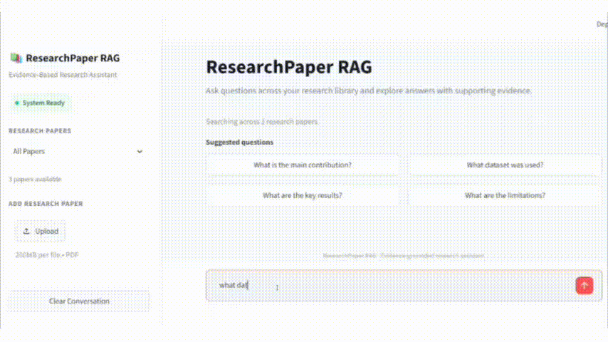
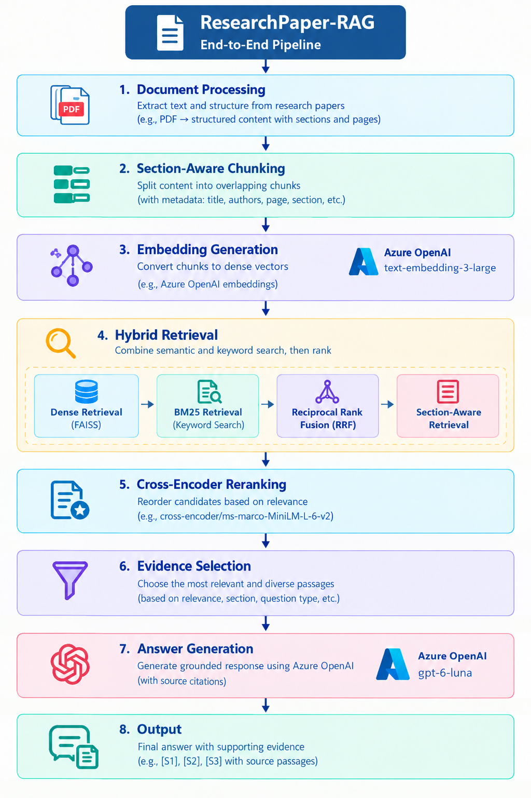

# ResearchPaper-RAG

An evidence-grounded Retrieval-Augmented Generation (RAG) system for querying and analyzing research papers using hybrid retrieval, section-aware candidate selection, neural reranking, and Azure OpenAI.

The system allows users to upload and query multiple research papers using natural-language questions. It combines dense semantic retrieval, BM25 keyword retrieval, Reciprocal Rank Fusion (RRF), question-type-aware section retrieval, Cross-Encoder reranking, evidence selection, and grounded answer generation.

Each generated answer is linked to supporting passages using source identifiers such as `[S1]`, `[S2]`, and `[S3]`, allowing users to inspect the evidence behind the response.

---

## Demo

# Overview

Research papers contain information distributed across sections such as introductions, datasets, methodology, experiments, results, and limitations. A single retrieval strategy may retrieve semantically related text without necessarily identifying the most useful evidence for a specific research question.

ResearchPaper-RAG addresses this using a multi-stage retrieval and generation pipeline combining dense semantic retrieval, BM25 keyword retrieval, Reciprocal Rank Fusion (RRF), section-aware retrieval, Cross-Encoder reranking, evidence selection, and grounded answer generation.

---

# Key Features

- Natural-language question answering over research papers
- Multi-document research-paper search
- Specific-paper and all-paper retrieval modes
- PDF extraction with page-level metadata
- Section-aware document processing
- Overlapping text chunking
- Dense semantic retrieval using FAISS
- BM25 lexical retrieval
- Reciprocal Rank Fusion (RRF)
- Question-type-aware retrieval
- Section-aware candidate injection
- Cross-Encoder neural reranking
- Evidence-aware source selection
- Source-paper diversity for multi-paper queries
- Azure OpenAI embeddings
- Azure OpenAI answer generation
- Evidence-grounded responses
- Source citations such as `[S1]`, `[S2]`, and `[S3]`
- Supporting Evidence display
- Streamlit-based user interface
- Research-paper upload through the application
- Unanswerable-query handling to reduce unsupported responses

---

# Technology Stack

| Component | Technology |
|---|---|
| Programming Language | Python |
| PDF Processing | PyMuPDF |
| PDF-to-Markdown Extraction | PyMuPDF4LLM |
| Chunking | Custom section-aware word chunking |
| Embeddings | Azure OpenAI `text-embedding-3-large` |
| Embedding Dimensions | 3072 |
| Vector Search | FAISS |
| Keyword Search | BM25 |
| Retrieval Fusion | Reciprocal Rank Fusion |
| Reranking | `cross-encoder/ms-marco-MiniLM-L-6-v2` |
| Large Language Model | Azure OpenAI |
| Numerical Processing | NumPy |
| User Interface | Streamlit |

---

# Architecture

The system follows a multi-stage RAG architecture designed to improve retrieval quality, evidence relevance, and answer traceability.

## 1. Document Processing

Research papers are extracted from PDF format using PyMuPDF and PyMuPDF4LLM.

The extraction workflow preserves:

- Page information
- Document structure
- Section headings
- Extracted text

The extracted content is then divided into overlapping chunks.

### Current Configuration

    Chunk size:       450 words
    Chunk overlap:    75 words

Each chunk stores metadata including:

    chunk_id
    title
    authors
    filename
    page
    section
    text

This metadata is retained throughout the retrieval pipeline and is later used for source attribution and Supporting Evidence display.

---

## 2. Embedding Generation

Each document chunk is converted into a dense vector using Azure OpenAI:

    text-embedding-3-large

The current embedding dimensionality is:

    3072

The vectors are normalized and stored in a FAISS index using inner-product similarity.

Generated index files:

    indexes/
    ├── dense.faiss
    └── chunks.jsonl

The FAISS index stores the vector representations while `chunks.jsonl` stores the corresponding chunk metadata.

---

## 3. Hybrid Retrieval

The system combines dense semantic retrieval with lexical BM25 retrieval.

### Dense Retrieval

FAISS performs semantic retrieval using the generated embeddings.

This allows the system to retrieve passages that are conceptually related to a question even when the exact wording differs.

For example:

    Question:
    How was the training data created?

    Retrieved evidence:
    The authors applied several augmentation operations...

The exact wording does not need to match for a semantically related passage to be retrieved.

### BM25 Retrieval

BM25 provides keyword-based retrieval and is particularly useful when questions contain:

- Dataset names
- Model names
- Technical terminology
- Exact scientific phrases
- Numerical terms

Dense retrieval provides semantic matching, while BM25 provides lexical matching.

Using both provides complementary retrieval signals.

---

## 4. Reciprocal Rank Fusion

The rankings produced by dense retrieval and BM25 are combined using Reciprocal Rank Fusion (RRF).

The general scoring form is:

    RRF(d) = Σ 1 / (k + rank(d))

where:

- `d` is a retrieved chunk
- `rank(d)` is the position of the chunk in a retrieval result list
- `k` is the RRF constant

The implementation uses:

    k = 60

RRF combines rankings without requiring the scores produced by the underlying retrieval systems to be directly comparable.

---

## 5. Section-Aware Retrieval

Research questions frequently correspond to specific sections of a research paper.

The retriever therefore detects common question types and prioritizes structurally relevant sections.

    Dataset question
           ↓
    Dataset / Data Description

    Methodology question
           ↓
    Methods / Methodology

    Results question
           ↓
    Results / Experiments

    Limitations question
           ↓
    Limitations

    Conclusion question
           ↓
    Conclusion

For example, a question such as:

    What dataset was used?

is more likely to be answered correctly by a dataset-description section than by a general introduction.

The implementation therefore combines semantic retrieval with the structural organization of research papers.

Section-aware candidate injection also allows highly relevant sections to enter the candidate pool even when they are not ranked highly enough by the initial dense or BM25 retrieval stages.

---

## 6. Cross-Encoder Reranking

The initial retrieval stage produces a broader candidate set.

These candidates are subsequently reranked using:

    cross-encoder/ms-marco-MiniLM-L-6-v2

The Cross-Encoder evaluates the question and candidate passage jointly:

    (question, passage)
            ↓
    Cross-Encoder
            ↓
    Relevance score

Candidates are sorted according to their Cross-Encoder relevance scores.

This creates a two-stage retrieval architecture:

    Stage 1
    Fast candidate retrieval
            ↓
    Stage 2
    Cross-Encoder relevance scoring
            ↓
    High-quality evidence

The purpose of reranking is to improve the precision of the evidence ultimately supplied to the language model.

---

## 7. Evidence Selection

After reranking, the system selects the passages that will be provided to the LLM.

Evidence selection considers:

- Retrieval relevance
- Cross-Encoder relevance
- Question type
- Section relevance
- Selected paper
- Source-paper diversity

Dataset-related questions receive additional priority for explicit dataset-description evidence.

For all-paper queries, source-paper diversity is also considered so that one document does not unnecessarily dominate the final evidence set.

---

## 8. Grounded Answer Generation

The selected passages are provided to Azure OpenAI together with instructions to answer using only the supplied evidence.

The generated response uses source identifiers such as:

    [S1]
    [S2]
    [S3]

For example:

    The study uses a satellite-image sequence dataset from
    the MediaEval 2019 Satellite Task [S1].

The corresponding source passage is displayed in the application's Supporting Evidence section.

This provides a direct path from:

    Answer
      ↓
    Citation
      ↓
    Retrieved passage
      ↓
    Original research paper

The LLM is also instructed to acknowledge insufficient evidence rather than invent unsupported information.

---

# Project Structure

    ResearchPaper-RAG/
    │
    ├── data/
    │   ├── papers/
    │   │   └── <research-paper>.pdf
    │   │
    │   └── processed/
    │       └── <paper>.jsonl
    │
    ├── indexes/
    │   ├── dense.faiss
    │   └── chunks.jsonl
    │
    ├── src/
    │   ├── dense_retriever.py
    │   ├── embeddings.py
    │   ├── hybrid_retriever.py
    │   ├── llm.py
    │   ├── pdf_loader.py
    │   ├── pdf_processor.py
    │   ├── preview_markdown.py
    │   ├── rag_pipeline.py
    │   ├── reranker.py
    │   ├── evaluate_system.py
    │   ├── evaluate_retrieval.py
    │   ├── evaluate_answers.py
    │   ├── evaluate_unanswerable.py
    │   ├── evaluate_latency.py
    │   ├── test_azure.py
    │   └── test_embedding.py
    │
    ├── app.py
    ├── .env
    ├── .gitignore
    ├── requirements.txt
    └── README.md

---

# Core Modules

## `src/pdf_processor.py`

Processes research papers placed in `data/papers/`.

It:

- Extracts PDF content
- Uses page-aware Markdown extraction
- Identifies document sections
- Creates overlapping chunks
- Attaches metadata to each chunk
- Writes processed JSONL files

Example metadata:

    chunk_id
    title
    authors
    filename
    page
    section
    text

---

## `src/pdf_loader.py`

Provides PDF-loading functionality used as part of the document-processing workflow.

---

## `src/embeddings.py`

Generates embeddings for processed chunks using Azure OpenAI.

It creates:

    indexes/dense.faiss
    indexes/chunks.jsonl

The FAISS index stores the dense vectors while `chunks.jsonl` stores the corresponding chunk metadata.

---

## `src/dense_retriever.py`

Performs semantic retrieval against the FAISS index.

It supports:

- Question-based retrieval
- Top-k retrieval
- Retrieval across all papers
- Filtering by a selected paper

---

## `src/hybrid_retriever.py`

Combines:

- FAISS semantic retrieval
- BM25 keyword retrieval
- Reciprocal Rank Fusion
- Section-aware retrieval
- Question-type-aware candidate selection

Supported question types include:

- Dataset
- Methodology
- Results
- Limitations
- Conclusion

The retriever also includes logic for table-related questions and relevant section prioritization.

---

## `src/reranker.py`

Loads the Cross-Encoder model:

    cross-encoder/ms-marco-MiniLM-L-6-v2

and reranks retrieved candidates according to question-passage relevance.

---

## `src/rag_pipeline.py`

Coordinates the complete RAG workflow:

    Question
       ↓
    Paper Scope
       ↓
    Hybrid Retrieval
       ↓
    Section-Aware Candidate Selection
       ↓
    Cross-Encoder Reranking
       ↓
    Evidence Selection
       ↓
    Evidence Context
       ↓
    Azure OpenAI
       ↓
    Grounded Answer

It also prepares the source information required for the Supporting Evidence section.

---

## `src/llm.py`

Handles Azure OpenAI communication for answer generation.

The LLM is instructed to:

- Use the retrieved evidence
- Avoid unsupported claims
- Cite evidence using `[S1]`, `[S2]`, etc.
- Distinguish evidence from inference
- Acknowledge when the available evidence is insufficient

---

## `app.py`

Provides the Streamlit interface.

The application allows users to:

- Select a research paper
- Search across all papers
- Upload additional papers
- Enter questions
- View generated answers
- Inspect supporting evidence

The implementation details remain behind the interface so that the application can be used as a practical research assistant without requiring users to understand the underlying retrieval architecture.

---

# Example Questions

The application can answer questions such as:

- What is the main contribution of the paper?
- What dataset was used?
- How large is the dataset?
- What preprocessing steps were applied?
- What methodology was followed?
- What model architecture was used?
- What were the key results?
- What was the best-performing configuration?
- What are the limitations?
- Which papers discuss satellite image classification?
- How do the approaches in these papers differ?

The application is not restricted to these predefined questions.

---

# Multi-Paper Search

The application supports two retrieval modes.

## Specific Paper

When a specific paper is selected, retrieval is restricted to that document.

    Selected Paper
          ↓
    Retrieve from selected paper
          ↓
    Rerank
          ↓
    Evidence Selection
          ↓
    Generate Answer

This is useful for detailed analysis of a particular research paper.

---

## All Papers

When `All Papers` is selected, the system retrieves evidence across the complete indexed collection.

Example queries include:

- Which paper discusses satellite image classification?
- How do the methods used in these papers differ?
- What datasets are used across these studies?

Source-paper metadata is retained throughout the retrieval pipeline so that final evidence can be traced back to its originating document.

---

# Example Answer

An illustrative response may look like:

    The study uses a satellite-image sequence dataset from the
    MediaEval 2019 Satellite Task [S1]. The dataset contains
    multiple image acquisitions for each event and includes
    different Sentinel-2 spectral bands [S1].

    The authors also apply several data augmentation operations
    to increase the amount of training data [S2].

The `[S1]` and `[S2]` references correspond to the supporting evidence displayed in the application.

The actual answer depends on the retrieved passages.

---

# Evaluation and Results

The system was evaluated using a small manually curated benchmark covering system integrity, retrieval quality, answer quality, unanswerable questions, and end-to-end latency.

The evaluation is intended to validate the implemented system and provide measurable evidence of its behavior rather than to claim universal performance across research-paper collections.

---

## 1. Deterministic System Validation

A deterministic validation suite checks the internal consistency and basic functionality of the retrieval system.

The following checks were performed:

- FAISS vector count matches chunk count
- Required chunk metadata is present
- Duplicate chunk IDs are absent
- All indexed papers are correctly represented
- Hybrid retrieval returns valid results
- Paper-level filtering returns only the selected document

### Result

    Checks passed: 6/6
    Overall result: PASS

The evaluated collection contained:

    Total papers: 3
    Total chunks: 91

Paper-level chunk distribution:

    2296_AnastasiaMoumtzidou_etal2020 (1).pdf    43 chunks
    Chen_Pre-Trained_Image_Processing_Transformer_CVPR_2021_paper.pdf
                                                   35 chunks
    InfluenceofSpectralBandsinSatelliteImageClassification.pdf
                                                   13 chunks

This confirms that the indexed vector and metadata stores are consistent and that document-level retrieval filtering behaves as expected.

---

## 2. Retrieval Evaluation

Retrieval quality was evaluated using five manually curated questions with known relevant chunks.

The evaluation reports:

- Recall@5
- Recall@10
- Mean Reciprocal Rank (MRR)
- Hit Rate@5
- Hit Rate@10

### Results

| Metric | Score |
|---|---:|
| Recall@5 | 0.633 |
| Recall@10 | 0.833 |
| MRR | 0.733 |
| Hit Rate@5 | 0.800 |
| Hit Rate@10 | 1.000 |

The results indicate that the system successfully retrieved at least one relevant passage within the top 10 results for all five evaluation questions.

The lower Recall@5 compared with Recall@10 indicates that some questions require a larger candidate set to capture all manually annotated relevant chunks.

One particularly challenging query involved identifying the spectral bands used in the flood-detection study. Relevant band-related chunks appeared at different ranks, illustrating that strict chunk-level recall can be sensitive to how information is distributed across overlapping chunks.

Because this benchmark contains only five manually curated questions, the results should be interpreted as a system-level validation benchmark rather than a statistically comprehensive evaluation.

---

## 3. Answer-Level Evaluation

Answer quality was manually evaluated over the same five-question benchmark.

Each answer was assessed on four dimensions:

- Correctness
- Relevance
- Faithfulness to retrieved evidence
- Citation correctness

A 2-point scale was used for each dimension.

### Results

| Evaluation Dimension | Score |
|---|---:|
| Correctness | 2.00 / 2.00 (100%) |
| Relevance | 1.80 / 2.00 (90%) |
| Faithfulness | 2.00 / 2.00 (100%) |
| Citation Correctness | 2.00 / 2.00 (100%) |

The results show that the evaluated answers were fully supported by the retrieved evidence and that the cited sources correctly corresponded to the evidence used.

The slightly lower relevance score resulted from broad all-paper questions where the system returned information from multiple documents. This behavior is expected for cross-document queries but can produce broader answers than a single-paper question.

The evaluation was manually verified against the source passages rather than relying solely on lexical-overlap metrics. This is important because scientifically correct answers may use terminology that differs from the exact wording of the source.

---

## 4. Unanswerable Query Evaluation

The system was also evaluated using five questions whose answers were not contained in the supplied research papers.

The test included questions requesting information such as:

- Authors' salaries
- GPU model used for training a model
- Institutional street address
- Exact publication acceptance date
- Authors' favorite programming language

The desired behavior was to explicitly state that the information was unavailable rather than generate an unsupported answer.

### Result

    Safe refusals: 5/5
    Safe-refusal rate: 100%

For example, when asked for information not present in the supplied evidence, the system responded that the evidence did not contain the requested information and therefore the answer could not be determined.

This demonstrates evidence-constrained behavior on the tested unanswerable-query benchmark.

The result should not be interpreted as a universal guarantee against hallucination; it is a measured result on a manually constructed five-question benchmark.

---

## 5. End-to-End Latency Evaluation

End-to-end latency was measured after a warm-up request to avoid including one-time pipeline initialization effects such as model loading.

The measured latency includes:

    Hybrid Retrieval
           ↓
    Cross-Encoder Reranking
           ↓
    Evidence Selection
           ↓
    Azure OpenAI Answer Generation

Five representative research questions were evaluated.

### Results

| Metric | Latency |
|---|---:|
| Average | 9.801 s |
| Median | 9.920 s |
| Minimum | 8.693 s |
| Maximum | 10.619 s |
| Successful requests | 5/5 |

The measured end-to-end response time is approximately 9–10 seconds per question under the evaluated configuration.

The Cross-Encoder and remote LLM generation contribute to the overall latency, providing a trade-off between retrieval quality, evidence grounding, and response time.

---

# Evaluation Methodology

The evaluation scripts used for system validation are included in the repository:

    src/evaluate_system.py
    src/evaluate_retrieval.py
    src/evaluate_answers.py
    src/evaluate_unanswerable.py
    src/evaluate_latency.py

The evaluation uses a small manually curated benchmark based on the research-paper collection currently indexed by the system.

The benchmark is intended to validate:

    System Integrity
           ↓
    Retrieval Quality
           ↓
    Answer Quality
           ↓
    Unsupported-Query Handling
           ↓
    End-to-End Performance

No ablation study is included in the current evaluation.

---

# Current Research Papers

The current development collection contains three research papers covering topics including:

- Flood detection
- Sentinel-2 satellite imagery
- Satellite image classification
- Image processing
- Vision Transformers

The current indexed collection contains:

    3 papers
    91 chunks
    3072-dimensional embeddings

Additional research papers can be added through the application or by placing PDFs in:

    data/papers/

---

# Installation

## 1. Clone the Repository

    git clone <your-github-repository-url>
    cd ResearchPaper-RAG

---

## 2. Create a Virtual Environment

On Windows:

    python -m venv .venv

Activate the environment:

    .venv\Scripts\activate

---

## 3. Install Dependencies

    pip install -r requirements.txt

---

# Configuration

The project uses Azure OpenAI for embeddings and answer generation.

Create a `.env` file in the project root.

Example:

    AZURE_OPENAI_API_KEY=your_api_key
    AZURE_OPENAI_ENDPOINT=your_endpoint

    AZURE_OPENAI_EMBEDDING_MODEL=text-embedding-3-large
    AZURE_OPENAI_EMBEDDING_API_KEY=your_embedding_api_key
    AZURE_OPENAI_EMBEDDING_ENDPOINT=your_embedding_endpoint

    AZURE_OPENAI_MODEL=your_llm_deployment_name

Never commit the `.env` file to GitHub.

---

# Adding Research Papers

Place PDF files inside:

    data/papers/

For example:

    data/
    └── papers/
        ├── paper1.pdf
        ├── paper2.pdf
        └── paper3.pdf

---

# Processing Research Papers

Run:

    python src\pdf_processor.py

The processor reads PDFs from:

    data/papers/

and creates processed JSONL files inside:

    data/processed/

---

# Building the Search Index

After processing the papers, generate embeddings and build the FAISS index:

    python src\embeddings.py

This generates:

    indexes/
    ├── dense.faiss
    └── chunks.jsonl

---

# Running the Application

Start the Streamlit application:

    streamlit run app.py

Streamlit will display the local application URL in the terminal.

---

# License

This project is intended for educational and research purposes.

If the project is distributed publicly, an appropriate open-source license can be added to the repository.

---

# Author

## Akanksha Pawar
M.Tech Graduate in Computer Science & Engineering

Research interests:
- Retrieval-Augmented Generation
- Generative AI
- Computer Vision
- Remote Sensing
- Satellite Image Analysis
- Deep Learning